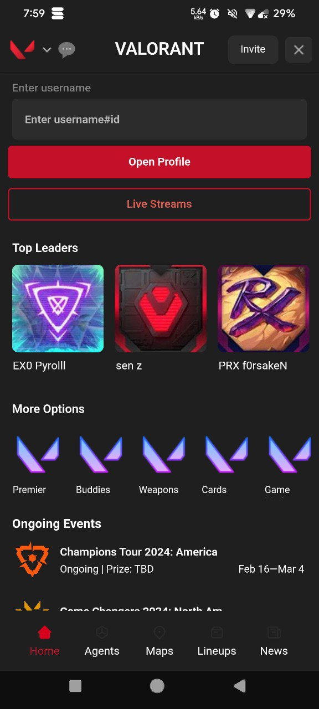

# Valorant Bot
Valorant game info bot on Switch

#### | [Check on Switch](https://iswitch.click/valorant_bot)

#### Screenshots
<p float="left">



</p>
<p float="left">


</p>

## Features
- Events Update
- Agents, Map, Lineups, Spray, etc
- Live youtube gameplay


## Prerequisites

Make sure you have the following installed before running the project:

- Python 3.10 or higher

## Setup

1. Clone the repository:

    ```bash
    git clone https://github.com/Switch-Bot-Samples/Valorant.git
    cd Valorant
    ```

2. Install dependencies:

    ```bash
    pip install -r requirements.txt
    ```

3. Create a `.env` file in the project root and add the following:

    ```env
    BOT_TOKEN=your_bot_token
    ```

    Replace `your_bot_token` with the actual token for your bot.

## Usage

Run the bot using the following command:

```bash
python valorant.py
```


## Contributing

If you'd like to contribute to the project, please follow the guidelines in [CONTRIBUTING.md](CONTRIBUTING.md).

## License

This project is licensed under the MIT License - see the [LICENSE.md](LICENSE.md) file for details.
